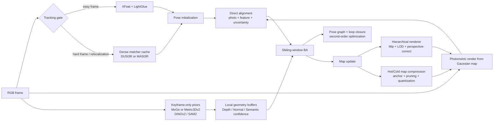
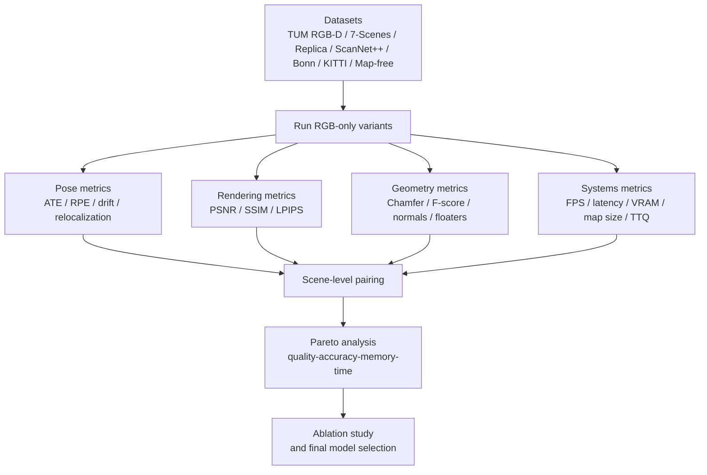

# Hướng cải tiến nền tảng cho MonoGS RGB-only sau khi đã tích hợp DUSt3R

## Tóm tắt điều hành

MonoGS là mốc nền quan trọng vì đây là hệ monocular SLAM đầu tiên dùng 3D Gaussian Splatting làm biểu diễn duy nhất cho tracking, mapping và rendering; bài báo gốc nhấn mạnh hệ chạy trực tiếp khoảng 3 fps, dùng direct optimization lên Gaussian để theo dõi camera, và bổ sung geometric verification/regularization để xử lý mơ hồ của tái thiết tăng dần. Điều đó làm MonoGS trở thành nền rất mạnh cho nghiên cứu, nhưng cũng chỉ ra rõ các nút thắt còn lại: tốc độ online chưa cao, backend còn dư địa lớn cho global consistency, map Gaussian dễ phình bộ nhớ, và chất lượng hình học/render vẫn bị giới hạn bởi các vấn đề vốn có của 3DGS như aliasing, sai khác bề mặt và xử lý cảnh động. citeturn19view0turn12view0turn25view0turn24view0turn6view5

Vì bạn đã tích hợp DUSt3R vào xử lý keyframe để giảm thời gian hội tụ và cải thiện mapping, bước tiếp theo hợp lý nhất không phải là “thêm một prior 3D mạnh hơn nữa” theo cùng một hướng, mà là giải quyết các nút thắt trực giao hơn với DUSt3R: bộ kết xuất phân cấp không alias và perspective-correct; front-end tracking dựa trên descriptor học được và uncertainty; backend tối ưu pose cửa sổ trượt có loop closure và second-order optimization; nén/bớt Gaussian online; và cuối cùng là hợp nhất Gaussian với prior hình học-bề mặt đơn ảnh để nâng chất lượng hình học sâu hơn. Các hướng này bám sát các tiến bộ gần đây như Mip-Splatting, Octree-GS, HTGS, XFeat, LightGlue, MASt3R, MASt3R-SLAM, Scaffold-GS, LightGaussian, Reduced-3DGS, 2DGS, SuGaR, MoGe, Metric3Dv2, SAM 2, WildGS-SLAM và OpenMonoGS-SLAM. citeturn12view0turn4view3turn12view3turn6view2turn6view3turn26view0turn23view0turn13view0turn24view0turn11view0turn25view0turn18search7turn20view0turn9view0turn9view3turn6view5turn7view0

Nếu mục tiêu là một paper cân bằng giữa tính mới, khả năng triển khai và xác suất có kết quả rõ ràng, tôi khuyến nghị ưu tiên theo thứ tự: **backend pose optimization có uncertainty và loop closure**, **bản đồ Gaussian thưa/nén online**, **renderer phân cấp không alias**, **frontend descriptor-thông minh cho tracking**, rồi **hình học lai với prior depth-normal-semantics**. Nếu mục tiêu là paper mạnh về **rendering + systems**, nên ghép hướng renderer phân cấp với nén Gaussian. Nếu mục tiêu là paper mạnh về **robustness + long sequence**, nên ghép frontend descriptor-thông minh với backend loop closure. Nếu mục tiêu là paper mạnh về **geometry quality**, nên ghép renderer phân cấp với regularization bề mặt lai. Phần dưới đây tách riêng năm hướng thành các đề xuất có thể publish độc lập. 

## Điểm xuất phát và nguyên tắc thiết kế

Điểm mạnh nhất của MonoGS là nó đã biến 3DGS từ một biểu diễn vốn phụ thuộc pose offline thành một biểu diễn có thể được tối ưu trực tiếp cho tracking trong SLAM monocular. Tuy nhiên, 3DGS gốc vốn khởi tạo từ sparse points sau camera calibration và tập trung vào real-time novel-view rendering chứ không tối ưu trực tiếp cho online monocular SLAM dài hạn; vì vậy khi chuyển sang SLAM, nhiều chi phí hệ thống mới xuất hiện: tối ưu pose-frame nối tiếp, chọn keyframe, kiểm soát nở map, và duy trì tính nhất quán toàn cục. citeturn12view1turn19view0

Ngoài ra, các hạn chế đã được các công trình hậu 3DGS chỉ ra khá rõ. Mip-Splatting cho thấy 3DGS có thể sinh artifact khi đổi scale nhìn do thiếu ràng buộc tần số 3D và do sử dụng 2D dilation; 2DGS chỉ ra 3D Gaussian khó biểu diễn bề mặt một cách nhất quán theo góc nhìn; Reduced-3DGS và LightGaussian cho thấy bộ nhớ 3DGS quá lớn và có nhiều thành phần dư thừa; Octree-GS và HTGS cho thấy vẫn còn khoảng trống lớn cho cấu trúc LOD, bảo toàn phối cảnh, và temporal stability của renderer. citeturn12view0turn25view0turn11view0turn24view0turn4view3turn12view3

Với giả định của bạn, DUSt3R đã xử lý tốt phần “khởi tạo/tăng tốc hội tụ keyframe”, tức là bài toán matching-pointmap ban đầu không còn là điểm nghẽn chính. Do đó, một roadmap nghiên cứu hợp lý là giữ DUSt3R như prior mạnh ở thời điểm cần, nhưng chuyển trọng tâm sang các câu hỏi mang tính SLAM hơn: làm sao giữ gradient render “sạch” hơn cho direct tracking; làm sao pose không trôi khi sequence dài; làm sao map không nở vô tội vạ; và làm sao bề mặt không thành “fog of Gaussians” ở vùng textureless, specular hoặc dynamic. Các công trình gần đây như MASt3R-SLAM, WildGS-SLAM và OpenMonoGS-SLAM cho thấy cộng đồng đang đi đúng vào các hướng đó. citeturn23view0turn6view5turn7view0

## Kiến trúc nghiên cứu đề xuất

Một kiến trúc khả thi cho giai đoạn tiếp theo là giữ lõi MonoGS + DUSt3R của bạn, nhưng thêm năm module gần như trực giao: frontend descriptor-thông minh, backend global optimization, renderer phân cấp không alias, hot/cold Gaussian map compression, và nhánh prior depth-normal-semantics chỉ chạy trên keyframe. Cách tổ chức này gần với tinh thần của MASt3R-SLAM ở chỗ tách rõ tracking, local fusion, graph construction và global optimization, đồng thời hấp thu các tiến bộ của Mip-Splatting/Octree-GS/HTGS ở renderer và của Scaffold-GS/LightGaussian/Reduced-3DGS ở representation. citeturn23view0turn12view0turn4view3turn12view3turn13view0turn24view0turn11view0

Nếu triển khai theo hướng gần real-time, ba nguyên tắc nên được giữ xuyên suốt. Thứ nhất, mọi thành phần nặng như MoGe, Metric3Dv2, SAM 2 hoặc đối sánh dày đặc kiểu MASt3R chỉ nên chạy trên keyframe hoặc khi tracker báo low-confidence. Thứ hai, renderer và backend phải được tách bất đồng bộ để tránh kéo tụt latency khung hình. Thứ ba, mọi thành phần thêm vào phải được đánh giá bằng “time-to-quality” chứ không chỉ bằng kết quả cuối, vì bạn đã có DUSt3R để giảm hội tụ ban đầu nên phần giá trị mới nằm ở việc giảm độ dốc tăng chi phí theo thời gian và cải thiện chất lượng ổn định lâu dài. citeturn23view0turn20view0turn9view0turn9view3turn26view0

## Năm cải tiến nền tảng khả thi

### Renderer phân cấp không alias và perspective-correct

**Mô tả ngắn.** Hướng này thay renderer “một tầng Gaussian phẳng” bằng renderer Gaussian phân cấp nhiều mức chi tiết, kết hợp lọc không alias theo tinh thần Mip-Splatting, chọn LOD theo Octree-GS, và đánh giá splat theo phối cảnh đúng cùng hybrid transparency theo HTGS. Điểm mấu chốt là ở MonoGS, tracking trực tiếp tối ưu lên ảnh render từ Gaussian; vì vậy nếu renderer phát sinh artifact về scale, popping hoặc projection, gradient pose cũng bị bẩn theo. Mip-Splatting chỉ ra nguyên nhân của artifact nằm ở thiếu ràng buộc tần số 3D và 2D dilation; Octree-GS cho thấy LOD có thể duy trì tốc độ render ổn định; HTGS cho thấy perspective-correct evaluation và hybrid transparency có thể tăng tới 2× frame rate và 2× tốc độ tối ưu hóa trên benchmark 3DGS trong khi giữ chất lượng ngang hoặc tốt hơn. citeturn12view0turn4view3turn12view3turn19view0

**Cách tiếp cận kỹ thuật.** Tôi đề xuất tổ chức Gaussian map theo submap hoặc chunk, trong mỗi chunk dùng anchor đa độ phân giải. Mỗi Gaussian hoặc mỗi anchor cần lưu thêm “frequency bound” và “LOD level”. Khi render, hệ thống chọn tập active splats bằng projected footprint và khoảng cách camera; những splat đang ở xa chỉ render ở mức coarse, những splat gần hoặc nằm trên biên mạnh mới được mở LOD cao. Về mặt rasterization, thay affine screen-space projection bằng perspective-correct evaluation kiểu HTGS, đồng thời thay 2D dilation bằng 2D mip filter và áp ràng buộc làm mượt 3D như Mip-Splatting. Để tránh nhìn “nhảy” giữa các mức, nên thêm cross-LOD consistency loss và temporal stability loss ở các keyframe liên tiếp. citeturn12view0turn12view3turn4view3

**Thay đổi thuật toán cần có.** Bạn sẽ phải sửa cả data structure lẫn kernel render. Ở tầng dữ liệu, thêm octree hoặc voxel-hash theo submap cùng chỉ số LOD cho Gaussian. Ở densification, thay heuristic hiện tại bằng anchor-growing có điều kiện dựa trên gradient và projected error, gần với Scaffold-GS, nhưng áp dụng online thay vì offline. Ở renderer, áp dụng tile culling theo LOD và frustum, sau đó rasterize với mip filter và hybrid transparency core/tail. Ở optimizer, cần cho tracking dùng ảnh render từ active LOD thay vì full map, và định kỳ tái cân bằng Gaussian giữa các mức khi reprojection error tích lũy cao. citeturn13view0turn4view3turn12view0turn12view3

**Lợi ích, đánh đổi và mục tiêu định lượng.** Đây là hướng có xác suất cao nhất để tăng đồng thời chất lượng render và độ ổn định của direct tracking. Mục tiêu định lượng hợp lý là tăng chất lượng render khoảng **0.5–1.5 dB PSNR**, giảm **5–15% LPIPS**, và tăng tốc render/tracking online khoảng **1.3–2.0×** trên cùng chất lượng đầu ra; riêng ở các giao thức stress-test về thay đổi scale nhìn, mức tăng có thể rõ hơn. Dải kỳ vọng này là suy ra bảo thủ từ việc Mip-Splatting loại bỏ aliasing theo scale, Octree-GS nhắm tới tốc độ render ổn định ở scene lớn, và HTGS báo cáo tới 2× frame rate cùng 2× tốc độ tối ưu hóa; trong SLAM online, gains thực tế thường nhỏ hơn do còn phụ thuộc backend pose và scheduler. Đánh đổi chính là độ phức tạp triển khai cao và khả năng phát sinh overhead quản lý LOD nếu culling chưa đủ tốt. citeturn12view0turn4view3turn12view3

**Độ phức tạp, metric, benchmark và ablation.** Độ phức tạp triển khai: **cao**. Metric nên báo gồm PSNR, SSIM, LPIPS, photometric residual của tracker, FPS render, FPS tracking, số vòng lặp tối ưu mỗi keyframe, và thêm một metric mới rất đáng dùng là **TTQ**: thời gian để đạt 90% chất lượng render cuối cùng. Benchmark phù hợp nhất là Replica và ScanNet++ cho NVS/chất lượng hình học, TUM RGB-D cho pose + render RGB-only, rồi thêm giao thức multi-scale kiểu Mip-Splatting: train/map với ảnh giảm độ phân giải rồi đánh giá ở độ phân giải cao hơn hoặc ở zoom khác. Ablation nên tối thiểu gồm: chỉ mip filter; chỉ perspective-correct projection; chỉ LOD; LOD + mip; LOD + perspective-correct; và bản đầy đủ. Replica có dense geometry và texture tốt; ScanNet++ có DSLR ảnh chất lượng cao và benchmark NVS; TUM RGB-D có ground-truth trajectory ở 30 Hz, thuận tiện cho RGB-only SLAM. citeturn21view1turn21view7turn22view0

### Frontend tracking bằng descriptor học được, uncertainty và keyframe policy thích nghi

**Mô tả ngắn.** Hướng này không thay DUSt3R ở keyframe mapping, mà thay frontend tracking từ “chủ yếu direct” sang “hybrid sparse learned features + direct alignment + uncertainty”. XFeat cho thấy local feature nhẹ có thể nhanh hơn tới 5× so với nhiều deep local feature khác mà vẫn giữ hoặc tăng độ chính xác; LightGlue cho thấy matching có thể thích nghi theo độ khó cặp ảnh; MASt3R cho thấy nếu gắn dense local features lên khung pointmap kiểu DUSt3R và dùng fast reciprocal matching thì matching tăng mạnh về độ mạnh và hiệu quả; còn WildGS-SLAM chứng minh uncertainty map dựa trên DINOv2 rất hữu ích để loại động vật/chuyển động và cân nặng residual trong tracking/mapping. citeturn6view2turn6view3turn26view0turn6view5turn9view2

**Cách tiếp cận kỹ thuật.** Một pipeline thực dụng là dùng XFeat + LightGlue cho mọi frame ở chế độ rẻ; nếu tracker báo khó qua các tín hiệu như inlier ratio thấp, photometric residual tăng nhanh, overlap giảm, hoặc entropy pose cao, thì chuyển sang dense fallback bằng cache MASt3R/DUSt3R trên keyframe gần nhất. Song song, trích DINOv2 feature map ở keyframe để tạo biểu diễn “trackability” và “uncertainty” theo vùng ảnh; vùng nào nhiều moving distractor, specular hoặc texture lặp thì giảm trọng số trong direct alignment. Keyframe selection cũng nên chuyển từ quy tắc hình học ngưỡng tĩnh sang một score đa thành phần gồm parallax, coverage gain, appearance novelty và uncertainty reduction potential. citeturn6view2turn6view3turn26view0turn9view2turn6view5

**Thay đổi thuật toán cần có.** Bạn cần thêm feature bank cho mỗi keyframe, gồm keypoints/descriptors, global descriptor phục vụ truy hồi keyframe cũ, và uncertainty/statics masks. Tracking sẽ thành hai pha: pha một là pose init bằng sparse matches hoặc essential/PnP; pha hai là refine bằng direct Gaussian alignment có trọng số uncertainty. Policy chuyển chế độ easy/hard nên học được hoặc ít nhất được điều chỉnh bằng calibration. Với chuỗi dài, nên lưu một “retrieval shortlist” để nếu lost-track thì truy hồi keyframe cũ trước khi gọi dense fallback đắt tiền. citeturn6view3turn17view0turn26view0turn9view2

**Lợi ích, đánh đổi và mục tiêu định lượng.** Vì DUSt3R của bạn đã cải thiện keyframe processing, lợi ích chính của hướng này là **giảm lost-track** và **nâng chất lượng pose init ở các frame khó**, nhất là low-texture, motion blur, thay đổi viewpoint hoặc ánh sáng. Mục tiêu định lượng hợp lý là giảm **10–25% ATE/RPE** trên các chuỗi khó, giảm **20–50% track-loss rate**, và tăng **5–15 điểm phần trăm inlier ratio**; overhead ở easy mode nên nằm cỡ **3–10 ms/frame** trên GPU hiện đại, còn dense fallback có thể cao hơn nhưng chỉ kích hoạt ở keyframe/frame khó. Dải này là kỳ vọng tương đối thực tế vì XFeat đã hướng tới real-time kể cả CPU rẻ, LightGlue có cơ chế thích nghi theo độ khó, và MASt3R cải thiện mạnh matching trên benchmark Map-free. Đánh đổi chính là pipeline tracking phức tạp hơn và cần tuning tốt giữa easy mode và hard mode. citeturn6view2turn6view3turn26view0

**Độ phức tạp, metric, benchmark và ablation.** Độ phức tạp triển khai: **trung bình đến cao**. Metric cần có: ATE RMSE, RPE tịnh tiến/quay, track-loss rate, relocalization success rate, inlier ratio, latency frontend, số lần kích hoạt dense fallback, và “time-to-first-stable-pose”. Benchmark hợp lý là TUM RGB-D cho indoor tracking chuẩn hóa, 7-Scenes cho relocalization và tracking dày đặc, Map-free cho tính bền vững của matching/pose under viewpoint shift, và KITTI odometry nếu bạn muốn kiểm tra ngoài trời monocular dài hơn. Ablation nên đi theo chuỗi: direct-only; XFeat-only; XFeat + LightGlue; XFeat + LightGlue + uncertainty; full pipeline với dense fallback; rồi thêm một ablation riêng cho keyframe score để xem thành phần novelty/uncertainty thật sự có đóng góp hay không. TUM RGB-D có pose ground truth chính xác từ motion capture; 7-Scenes có tracked RGB-D frames và train/test splits rõ ràng; Map-free benchmark nhấn mạnh cả độ chính xác lẫn confidence; KITTI cho phép gửi monocular odometry. citeturn22view0turn21view3turn21view6turn21view5

### Backend pose optimization cửa sổ trượt, uncertainty-aware và có loop closure

**Mô tả ngắn.** Hướng này nhắm thẳng vào sai số tích lũy và scale drift của monocular RGB-only SLAM. MASt3R-SLAM cho thấy một hệ monocular dense SLAM có thể kết hợp pointmap matching, local fusion, graph construction, loop closure và second-order global optimization mà vẫn đạt khoảng 15 FPS và tạo globally-consistent poses; WildGS-SLAM chỉ ra uncertainty map giúp cả dense bundle adjustment lẫn Gaussian map optimization trong môi trường động. Từ đó, cải tiến publishable cho MonoGS là nâng backend từ “local direct tracking + map update” sang **sliding-window Gaussian BA + asynchronous pose graph + loop closure** với residual được cân bởi uncertainty. citeturn23view0turn6view5

**Cách tiếp cận kỹ thuật.** Tôi đề xuất state của cửa sổ trượt gồm pose keyframe, affine exposure hoặc photometric calibration nhẹ, và một tập con Gaussian “active” có ảnh hưởng lớn tới các frame trong cửa sổ. Residual nên gồm ba nhóm: residual ảnh (rendered-vs-observed), residual feature/reprojection, và residual prior độ sâu-pháp tuyến khi có keyframe prior. Mỗi residual được gán trọng số từ uncertainty map hoặc từ quan sát co-visibility của Gaussian. Khi phát hiện loop bằng retrieval, tạo edge giữa keyframe xa thời gian nhưng gần hình ảnh/hình học, rồi giải theo second-order sparse solver trên thread hoặc stream riêng. Phần Gaussian update chỉ cần joint optimize với active subset để giữ tốc độ. citeturn23view0turn6view5turn17view0

**Thay đổi thuật toán cần có.** Bạn phải bổ sung backend scheduler, pose graph structure, truy hồi loop candidates, và chiến lược marginalization theo Hessian để cửa sổ không phình. Một chi tiết quan trọng là cache Jacobian hoặc ít nhất cache visibility/association của Gaussian đối với keyframe, vì direct BA trên Gaussian rất đắt nếu mỗi vòng phải dựng lại toàn bộ. Nếu muốn tận dụng DUSt3R hiện có, bạn có thể đưa scale prior nhẹ từ pointmap alignment của keyframe vào backend để chống scale drift. Đây là hướng đòi hỏi chỉnh sửa sâu nhất ở kiến trúc tổng thể nhưng cũng là hướng khoa học “SLAM-core” rõ nhất. citeturn19view0turn23view0turn17view2

**Lợi ích, đánh đổi và mục tiêu định lượng.** Đây là hướng tôi đánh giá có **lợi nhuận khoa học lớn nhất** sau khi bạn đã có DUSt3R để đẩy nhanh hội tụ local. Mục tiêu định lượng hợp lý là giảm **20–40% ATE** trên chuỗi dài và loop-rich, giảm **15–35% drift trên đơn vị quãng đường**, đồng thời tăng rõ relocalization success rate sau khi mất track. Nếu backend chạy bất đồng bộ hợp lý, overhead online có thể giữ dưới **30–80 ms cho mỗi keyframe** mà không khóa luồng tracking. Dải kỳ vọng này xuất phát từ việc MASt3R-SLAM đã chứng minh globally-consistent poses ở 15 FPS với loop closure và second-order optimization, cộng với bằng chứng từ WildGS-SLAM rằng uncertainty-guided BA cải thiện cả tracking lẫn map. Đánh đổi chính là phức tạp triển khai rất cao, debugging khó, và cần cẩn thận để không làm pipeline bị latency spike. citeturn23view0turn6view5

**Độ phức tạp, metric, benchmark và ablation.** Độ phức tạp triển khai: **rất cao**. Metric phải gồm ATE toàn cục, RPE, drift theo mét, loop closure recall/precision, relocalization success rate, số vòng GN/LM để hội tụ, latency backend, và TTQ cho pose ổn định. Benchmark nên lấy TUM RGB-D, 7-Scenes và Replica cho indoor loops; KITTI cho monocular odometry dài; nếu bạn muốn thêm độ khó về confidence/retrieval thì dùng Map-free như benchmark phụ. Ablation nên có ít nhất: local-only backend; sliding-window only; sliding-window + uncertainty; sliding-window + loop closure; second-order full backend; và full backend + scale prior từ pointmap. Ngoài ra, cần quét theo window size, tần suất global optimize và ngưỡng retrieval. citeturn22view0turn21view3turn21view1turn21view5turn21view6

### Bản đồ Gaussian thưa, anchor-based và nén online

**Mô tả ngắn.** Đây là hướng trực diện nhất cho bài toán memory consumption và reconstruction time. Scaffold-GS đề xuất biểu diễn bằng anchor points sinh Gaussian cục bộ theo hướng nhìn, nhấn mạnh hội tụ nhanh hơn, ít primitive hơn và chất lượng hình cao hơn; LightGaussian dùng pruning, distillation và VecTree quantization để đạt trung bình hơn 15× compression và tăng FPS từ 139 lên 215; Reduced-3DGS giảm một nửa primitive, chọn số SH theo Gaussian và quantization để đạt giảm kích thước tổng thể khoảng 27× cùng 1.7× speedup; Compressed 3DGS báo cáo tới 31× compression và tới 4× framerate cao hơn trên lightweight GPU. Từ góc nhìn SLAM, đây là nền cực tốt cho một “online compact MonoGS”. citeturn13view0turn24view0turn11view0turn11view2

**Cách tiếp cận kỹ thuật.** Một thiết kế phù hợp cho SLAM là chia map thành **hot tier** và **cold tier**. Hot tier gồm vùng mới quan sát hoặc đang trong cửa sổ tối ưu; lưu ở FP16/FP32 và không nén mạnh để sửa online. Cold tier gồm vùng đã ổn định; chuyển sang anchor-based representation, giảm SH degree thích nghi, pruning theo significance, rồi quantize theo chunk. Trong mỗi chunk, chỉ spawn các Gaussian có ý nghĩa với góc nhìn hiện tại; vùng ít quan sát hoặc ít đóng góp vào ảnh render thì giữ ở mức coarse. Khi loop closure hoặc revisiting phát hiện vùng cũ cần tinh chỉnh lại, chunk đó được “thaw” từ cold tier về hot tier. Câu chuyện khoa học ở đây là thiết kế **online reversible compression** thay vì compression sau tối ưu như ở nhiều paper 3DGS chuẩn. citeturn13view0turn24view0turn11view0

**Thay đổi thuật toán cần có.** Bạn cần thay flat Gaussian array bằng chunked map manager. Mỗi Gaussian hoặc anchor có score significance dựa trên visibility, opacity, gradient energy, projected size, co-visibility và recency. Scheduler nền sẽ định kỳ prune hoặc quantize cold chunks. Để tránh giảm chất lượng không hồi phục, nên có bước recovery tương tự LightGaussian: nếu chunk bị quantize mà tái quan sát gây tăng residual rõ rệt, cho phép phục hồi tạm thời SH hoặc sinh lại Gaussian con. Nếu muốn câu chuyện mạnh hơn, bạn có thể thêm “memory budget controller” đặt ngưỡng VRAM mục tiêu và để hệ thống tự chọn prune/quantize/offload sao cho vẫn giữ pose quality. citeturn24view0turn11view0turn11view2

**Lợi ích, đánh đổi và mục tiêu định lượng.** Đây là hướng tốt nhất để cải thiện **memory** và cũng thường kéo theo tăng tốc render/map. Mục tiêu định lượng hợp lý trong bối cảnh SLAM online là giảm **4–10× VRAM hoặc active-memory footprint**, giảm **10–25× kích thước map lưu trữ trên đĩa**, giảm **40–70% số Gaussian active**, và tăng **20–80% FPS render/update** với suy giảm chất lượng chấp nhận được, cỡ **≤0.3–0.8 dB PSNR** hoặc LPIPS tăng rất nhỏ. Dải kỳ vọng này thực tế vì các con số báo cáo ở literature cho setting offline còn lớn hơn; nhưng trong online SLAM nên kỳ vọng bảo thủ hơn do cần khả năng backtrack/sửa map. Đánh đổi là pipeline quản lý bộ nhớ phức tạp hơn, có nguy cơ tạo lag khi thaw/freeze chunk, và chất lượng biên mịn có thể tụt nếu quantize quá mạnh. citeturn13view0turn24view0turn11view0turn11view2

**Độ phức tạp, metric, benchmark và ablation.** Độ phức tạp triển khai: **trung bình đến cao**. Metric bắt buộc: VRAM peak, VRAM growth slope theo thời gian, số Gaussian active/tổng, dung lượng map trên đĩa, FPS render, latency update, TTQ để đạt chất lượng map mục tiêu, và ATE/PSNR/LPIPS để đo chất lượng không bị hy sinh quá mức. Benchmark nên phủ cả sequence ngắn và dài: TUM RGB-D cho indoor pose, Replica cho quality render + geometry sạch, ScanNet++ cho scene lớn/hình ảnh chất lượng cao, và sequence tự quay dài để đo memory growth theo thời gian. Ablation nên gồm: pruning-only; quantization-only; anchor-only; anchor + pruning; anchor + pruning + SH adaptation; full hot/cold reversible compression. Replica và ScanNet++ đặc biệt hữu ích vì có geometry/texture tốt để thấy rõ cost-quality trade-off. citeturn22view0turn21view1turn21view7

### Hợp nhất hình học lai và prior depth-normal-semantics từ ảnh RGB đơn

**Mô tả ngắn.** Đây là hướng nâng chất lượng tái thiết sâu nhất: không chỉ tối ưu Gaussian để khớp ảnh, mà còn buộc Gaussian bám một cấu trúc bề mặt hoặc prior hình học đáng tin cậy. 2DGS cho thấy 3DGS không mô hình hóa bề mặt tốt do multi-view inconsistency, trong khi 2D planar Gaussians với perspective-correct splatting cùng depth-distortion và normal-consistency giúp tái thiết hình học sạch hơn; SuGaR cho thấy có thể ép 3DGS về surface-aligned structure để trích mesh chính xác trong vài phút trên một GPU; Metric3Dv2 và MoGe cung cấp zero-shot metric depth/normal, thậm chí metric point maps và intrinsics/FOV; WildGS-SLAM cho thấy uncertainty + DINOv2 hữu ích để loại thành phần động; và OpenMonoGS-SLAM chỉ ra rằng nếu thêm semantics, cần cơ chế bộ nhớ riêng cho feature chiều cao. citeturn25view0turn18search7turn9view0turn20view0turn6view5turn7view0

**Cách tiếp cận kỹ thuật.** Hướng publishable cụ thể là tạo **local surface layer** bên cạnh Gaussian map. Trên mỗi keyframe, chạy một prior đơn ảnh như MoGe-2-normal hoặc Metric3Dv2 để lấy depth/pointmap/normal có confidence; dùng chúng để sinh local surfel field hoặc local SDF/TSDF mỏng. Sau đó, các Gaussian “mature” bị regularize bởi khoảng cách đến surface layer và bởi normal consistency. Ở vùng có độ tin cậy thấp hoặc dynamic, dựa vào uncertainty từ DINOv2/WildGS-SLAM và mask video-segmentation kiểu SAM 2 để không đưa vào static map, hoặc đưa vào một **ephemeral Gaussian pool** có thời gian sống ngắn. Nếu bạn muốn thêm semantics mở, chỉ nên lưu semantic embedding ở anchor/chunk level hoặc dưới dạng low-rank/PCA để tránh phình bộ nhớ như vấn đề mà OpenMonoGS-SLAM phải giải bằng memory mechanism riêng. citeturn20view0turn9view0turn6view5turn9view2turn9view3turn7view0

**Thay đổi thuật toán cần có.** Bạn cần thêm nhánh prior keyframe-only, local surface buffer, các loss mới gồm depth consistency, normal consistency, surface alignment hoặc signed-distance penalty, và policy tách static/dynamic Gaussian. Nếu muốn an toàn về thời gian, chỉ chạy prior trên keyframe và propagate bằng warp/track sang vài frame lân cận. Về renderer, không nhất thiết thay toàn bộ sang 2DGS; cách thực dụng hơn là dùng 2DGS/SuGaR như nguồn cảm hứng cho **regularizer cục bộ**, trong khi vẫn render chính bằng 3D Gaussian để giữ tốc độ. Đây là một cách dung hòa rất hợp lý giữa publishability và công sức. citeturn25view0turn18search7turn20view0turn9view0

**Lợi ích, đánh đổi và mục tiêu định lượng.** Đây là hướng có upside lớn nhất cho **geometry quality**, nhất là ở vùng textureless, cạnh mảnh, specular hoặc dynamic. Mục tiêu định lượng hợp lý là tăng **5–15 điểm F-score hình học** hoặc giảm **10–25% Chamfer distance**, giảm rõ số floater/ghosting, và cải thiện **10–20% ATE** ở các chuỗi có texture yếu hoặc nhiều phần tử động; nếu schedule prior đúng cách, tổng reconstruction time có thể gần như trung tính vì số vòng tối ưu map giảm, dù latency trên keyframe chắc chắn tăng. Đổi lại, đây là hướng dễ bị bias bởi prior network, nên phải có confidence gating rất chặt và report rõ trường hợp prior làm hại. Đây cũng là hướng có rủi ro nghiên cứu cao hơn, nhưng nếu làm tốt thì giá trị publication mạnh. citeturn25view0turn18search7turn20view0turn9view0turn6view5

**Độ phức tạp, metric, benchmark và ablation.** Độ phức tạp triển khai: **cao đến rất cao**. Metric cần có ngoài ATE/RPE là Chamfer distance, F-score mesh/point cloud, normal angular error, depth AbsRel hoặc scale-invariant RMSE nếu dataset có depth GT, tỉ lệ artifact động còn sót, và TTQ để đạt completeness mục tiêu. Benchmark phù hợp nhất là Replica và ScanNet++ cho geometry/render, TUM RGB-D dùng RGB-only input nhưng depth/trajectory làm ground truth, Bonn dynamic cho đánh giá dynamic robustness, và KITTI nếu muốn thử prior monocular ngoài trời. Ablation nên tách: depth-only prior; depth + normal; depth + normal + surface regularizer; thêm dynamic masking; thêm semantic memory; full system. Bonn dynamic cung cấp 24 sequence động và point cloud tĩnh GT để đo mô hình tái thiết; TUM RGB-D, Replica và ScanNet++ đều thuận lợi cho RGB-only input với ground truth chỉ dùng để chấm. citeturn21view4turn22view0turn21view1turn21view7turn21view5

## So sánh tổng hợp và thứ tự ưu tiên

Bảng dưới đây là đánh giá **định tính** trong bối cảnh bạn đã có MonoGS + DUSt3R. Dấu nhiều hơn nghĩa là tác động kỳ vọng lớn hơn; ký hiệu “±” nghĩa là có thể tốt hoặc xấu tùy scheduler và mức độ tối ưu hệ thống.

| Cải tiến | Render quality | Tracking accuracy | Memory | Reconstruction time | Publishability | Độ khó triển khai | Độ trực giao với DUSt3R |
|---|---|---:|---:|---:|---|---|---|
| Renderer phân cấp không alias, perspective-correct | +++ | ++ | + | ++ đến +++ | Rất cao | Cao | Cao |
| Frontend descriptor-thông minh + uncertainty + keyframe policy | + | +++ | ± | ++ | Cao | Trung bình đến cao | Trung bình |
| Backend sliding-window + loop closure + second-order optimization | + | +++ | ± | + đến ++ | Rất cao | Rất cao | Rất cao |
| Gaussian map thưa, anchor-based và nén online | + đến ++ | + | +++ | ++ đến +++ | Cao | Trung bình đến cao | Rất cao |
| Hình học lai + prior depth-normal-semantics | ++ đến +++ | ++ | + | ± đến + | Rất cao | Cao đến rất cao | Cao |

Nhìn theo góc độ chiến lược publication, **backend global optimization** là hướng mạnh nhất nếu bạn muốn đóng góp cốt lõi về SLAM; **nén Gaussian online** là hướng có tỷ lệ “effort / gain” tốt nhất cho systems paper; **renderer phân cấp** là hướng tốt nhất nếu muốn ghi điểm cả ở rendering lẫn tracking; còn **hình học lai** là hướng có biên độ kết quả cao nhất nhưng rủi ro cũng lớn nhất. Đánh giá này bám theo các xu hướng và kết quả đã được báo cáo bởi MonoGS, MASt3R-SLAM, Mip-Splatting, Octree-GS, HTGS, Scaffold-GS, LightGaussian, Reduced-3DGS, 2DGS, SuGaR, MoGe và WildGS-SLAM. citeturn19view0turn23view0turn12view0turn4view3turn12view3turn13view0turn24view0turn11view0turn25view0turn18search7turn20view0turn6view5

Nếu phải chọn **một** hướng để làm trước, tôi khuyên chọn **backend sliding-window + loop closure + second-order optimization**. Nếu phải chọn **hai** hướng để xây thành một paper cân bằng, tôi khuyên **backend + nén Gaussian online**. Nếu mục tiêu nằm ở chất lượng render/reconstruction để tạo demo ấn tượng, hãy chọn **renderer phân cấp + hình học lai**. Nếu bạn muốn một hướng ít rủi ro hơn để ra kết quả nhanh, hãy bắt đầu từ **frontend descriptor-thông minh** rồi nối sang backend. 

## Thiết kế thực nghiệm và quy trình đánh giá

Vì bài toán của bạn là RGB-only Visual SLAM, giao thức nên thống nhất như sau: **mọi phương pháp chỉ nhận RGB làm input trong chạy online**, còn depth, mesh hoặc ground-truth trajectory của dataset chỉ dùng để chấm điểm. TUM RGB-D rất phù hợp cho pose benchmark vì cung cấp RGB-D và ground-truth trajectory từ motion capture với camera tracking 100 Hz; 7-Scenes có tracked RGB-D frames, train/test split và được dùng nhiều cho mapping/relocalization; Replica cung cấp geometry dày, texture HDR và semantics/instances; ScanNet++ là benchmark indoor fidelity cao với 1000+ scene, laser scans dưới milimet, DSLR ảnh 33 MP và benchmark NVS; Bonn Dynamic cho 24 sequence động và point cloud tĩnh ground truth; KITTI cho monocular odometry ngoài trời; Map-free bổ sung một benchmark truy hồi/pose nhấn mạnh cả độ chính xác lẫn confidence. citeturn22view0turn21view3turn21view1turn21view7turn21view4turn21view5turn21view6

Một ma trận thực nghiệm tốt nên có ba nhóm. Nhóm thứ nhất là **pose**: ATE, RPE, drift/m, tỷ lệ mất track, relocalization success. Nhóm thứ hai là **render/geometry**: PSNR, SSIM, LPIPS, Chamfer distance hoặc F-score nếu có mesh/point cloud GT, normal angular error, số floater hoặc dynamic artifact rate. Nhóm thứ ba là **systems**: FPS tracking, FPS rendering, latency keyframe, TTQ để đạt 90% chất lượng cuối, VRAM peak, tốc độ tăng VRAM theo thời gian, active Gaussian count, kích thước map trên đĩa, và throughput của backend/compression. Đặc biệt, vì bạn đã cải thiện hội tụ bằng DUSt3R, metric **TTQ** và **memory-growth slope** sẽ rất thuyết phục trong paper hơn là chỉ báo cáo kết quả cuối. 

Về ablation, tôi khuyên không làm kiểu “bật/tắt từng loss” một cách rời rạc ngay từ đầu, mà tổ chức thành hai lớp. Lớp thứ nhất là **ablation theo trục đóng góp chính**: baseline MonoGS; baseline + DUSt3R hiện tại; rồi lần lượt cộng từng hướng mới một. Lớp thứ hai là **ablation trong từng hướng**: ví dụ với renderer thì tách mip, LOD, perspective-correct; với frontend thì tách XFeat, LightGlue, uncertainty, fallback dense matcher; với backend thì tách sliding-window, loop closure, second-order solver; với compression thì tách anchor, pruning, SH-adaptation, quantization, hot/cold tier; với hình học lai thì tách depth prior, normal prior, surface regularizer, dynamic masks. Cách tổ chức này giúp reviewer nhìn rõ “đóng góp chính” và “vì sao mô hình đầy đủ tốt hơn”. 

Một protocol rất hợp lý cho bài báo là báo cáo ba package cuối cùng thay vì chỉ một mô hình full-stack. **Package Robust** gồm frontend descriptor-thông minh + backend uncertainty-aware. **Package Efficient** gồm renderer phân cấp + nén Gaussian online. **Package Geometry** gồm renderer phân cấp + hình học lai. Sau đó bạn có thể bổ sung một mô hình “Full” như upper bound. Cách trình bày này thường mạnh hơn vì nó cho thấy từng hướng có giá trị độc lập, tránh cảm giác “kitchen-sink integration”.

## Tài liệu tham khảo chính

Cho phần lõi MonoGS và priors 3D từ ảnh, các nguồn nên đọc trực tiếp trước tiên là **Gaussian Splatting SLAM** của Matsuki và cộng sự, **DUSt3R**, **MASt3R**, và **MASt3R-SLAM**. Đây là nhóm nguồn quan trọng nhất để thiết kế tracking/mapping và cách tận dụng pointmap prior trong monocular SLAM. citeturn19view0turn17view2turn26view0turn23view0

Cho hướng renderer và biểu diễn, các nguồn gốc quan trọng là **3D Gaussian Splatting**, **Mip-Splatting**, **Octree-GS**, **HTGS**, **Scaffold-GS**, **LightGaussian**, **Reducing the Memory Footprint of 3D Gaussian Splatting**, và **Compressed 3D Gaussian Splatting**. Đây là nhóm tài liệu quyết định trực tiếp đến render quality, active Gaussian count, tốc độ render và footprint bộ nhớ của bản đồ. citeturn12view1turn12view0turn4view3turn12view3turn13view0turn24view0turn11view0turn11view2

Cho hướng geometry priors, features và scene understanding, các nguồn gốc quan trọng là **2DGS**, **SuGaR**, **XFeat**, **LightGlue**, **DINOv2**, **MoGe**, **Metric3Dv2**, **SAM 2**, **WildGS-SLAM**, và **OpenMonoGS-SLAM**. Đây là nhóm tài liệu phù hợp nhất nếu bạn muốn đẩy MonoGS theo hướng robust tracking, anti-dynamic, geometry quality và semantic-aware mapping mà vẫn giữ RGB-only. citeturn25view0turn18search7turn6view2turn6view3turn9view2turn20view0turn9view0turn9view3turn6view5turn7view0